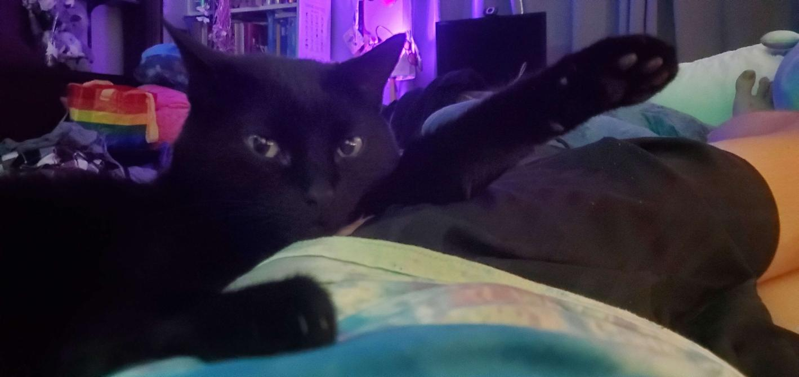

<div align="center">

<h3>johnny consumer guide</h3>
thank you for showing interest in johnny (:<br/><br/>
</div>

## before we start

i am assuming you have absolutely no experience with programming, let alone rust and i know if that is the case this may be daunting, but i assure you it is simpler than it seems. however, it will assume that you have at least basic understanding of how to use the command line. before you think about having to compile for yourself, make sure you can't get a prebuilt binary from here (**coming soon**). If a feature pair that you would like is not there, then you will have to compile johnny for yourself.

## compilation

### downloading the rust toolchain

johnny is written using a programming language called [rust](https://www.rust-lang.org/), and you need to have it installed to continue. you can get it from [here](https://www.rust-lang.org/tools/install)

### getting the source code

if you have [git](https://git-scm.org/) (do not worry if you don't), you can clone the repository using `git clone https://github.com/newtykins/johnny`

otherwise, you can download the source code as a zip archive [here](https://github.com/newtykins/johnny/archive/refs/heads/main.zip). extract the folder inside, and open a command prompt inside of it.

### choosing the features for you

rust allows for something called [conditional compilation](https://en.wikipedia.org/wiki/Conditional_compilation), which means that not all of the code needs to be included in the final build. this is used in johnny to avoid bloat - only the features that you need are included in the final binary. this means that you must choose the features that you want to have on the bot, you can see a list of all of the currently available features below. keep a mental note of the ones you like, because we will need these momentarily.

<table>
	<thead>
		<tr>
			<th>feature name</th>
			<th>description</th>
		</tr>
	</thead>
	<tbody>
		<tr>
			<th>autorole</th>
			<th>apply a role when a member joins the server</th>
		</tr>
		<tr>
			<th>pride</th>
			<th>overlay pride flags on images</th>
		</tr>
		<tr>
			<th>tui</th>
			<th>replaces the basic logger with a <a href="https://en.wikipedia.org/wiki/Text-based_user_interface">text-based user interface</a> with far more features</th>
		</tr>
		<!--
		<tr>
			<th></th>
			<th></th>
		</tr>
		-->
	</tbody>
</table>

there are also some core features which enables certain combinations of the features above. these are listed below.

<table>
	<thead>
		<tr>
			<th>core feature name</th>
			<th>enabled features</th>
		</tr>
	</thead>
	<tbody>
		<tr>
			<th>moderation</th>
			<th>autorole</th>
		</tr>
		<tr>
			<th>image</th>
			<th>pride</th>
		</tr>
	</tbody>
</table>

note that if you end up having chosen any of the following features, you must also select a database driver. more about this after the list.

- autorole

the database drivers are offered through special feature flags. please choose one of the following, depending on which database you want to use. explanations on how to set up each database are not within the scope of this guide, however plenty of great tutorials exist online explaining it. **sqlite** is definitely the easiest for beginners, however will not scale well if you want to provide your instance of the bot to a large amount of users, so keep that in mind. the options you have are as follows:

- sqlite
- postgres
- mysql

**it is important that you only choose one database driver, otherwise compilation will fail. compilation also fails if you choose a feature that requires a database driver and one has not been found.**

### compiling

now that you have chosen your feature set, you may compile your bot! note that this command may take a while to execute depending on which features you select. the command you are going to need to run is as follows:

```
cargo build --release --features <features>
```

where **\<features\>** is a comma separated list of your selected features. note that you may not put spaces in this list, and all features should be lowercase. an example may look like `tui,moderation,pride`

## execution

### creating a bot account

head to the [discord developer dashboard](https://discord.com/developers) and create a new application. call it whatever you would like your instance of the bot to be called. head to the bot tab of the application, and create a bot user. copy the discord token and keep it safe - if you give this to anyone else they will now have control over the bot and that is not good at all, so please be careful!

### running the bot

a different file will be output based on the operating system you are using to compile. they are listed below:

- windows: `target/release/bot.exe`
- macos/linux: `target/release/bot`

you can move this file wherever you would like and run the file and johnny will start - or so you'd think. actually, it throws an error. this is because you need a configuration file. this will soon be handled by the **tui** if you have that feature enabled but for now you must have a file called **config.toml** in the same directory as your executable.

copy and paste the contents of [config.toml.example](config.toml.example) into a file called **config.toml** in the same directory as your executable and fill in the values. re-run the bot, and it should boot up just fine.

good job! by this point you should now have a functioning instance of johnny! if you had any issues, you can ~~report them to our friendly community on discord~~ message me on discord @newtykip and i would be happy to help! i hope you enjoy using johnny, and if you find any issues please do not be scared to [report an issue](https://github.com/newtykins/johnny/issues). have a good rest of your day/night [:

<sub>licensed with the <a href="license.md">opinionated queer license v1.1</a> - tl;dr see <a href="https://oql.avris.it/">here</a> :]</sub>
