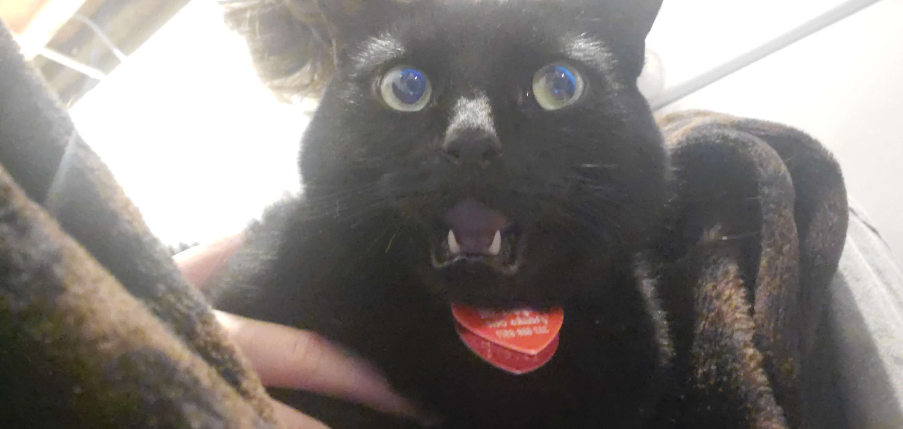

<div align="center">

<h3>johnny developer guide</h3>
thank you for showing interest in contributing (:<br/><br/>
</div>

## before we start

i am grateful that you are considering helping out, it really does mean a lot! johnny is a bot with a lot of moving components and due to the fact it is conditionally compiled extra care must be taken while implementing new features! in order to make the development lifecycle as beginner friendly as possible, we use a couple of tools while developing johnny. these are as follows:

- [just](https://github.com/casey/just) - a task runner
- [taplo](https://github.com/tamasfe/taplo) - a [toml](https://en.wikipedia.org/wiki/TOML) toolkit, formats all of the toml files
- [cargo-generate](https://github.com/cargo-generate/cargo-generate) - scaffolding tool for new packages
- [cargo-all-features](https://github.com/frewsxcv/cargo-all-features) - build/test all feature flag combinations
- [cargo-clean-recursive](https://crates.io/crates/cargo-clean-recursive) - clean target directories recursively

You can install all of the above using the following command:

```
cargo install just taplo-cli cargo-generate cargo-all-features
```

All workflows are defined in our [justfile](justfile) and each task can be run using `just <task>`. All available tasks are documented below.

- **clean** - cleans all target directories recursively
- **format** - formats all code using rustfmt, and toml files using taplo
- **new-package** - generates a new package using the [template](template)
- **build-all** - build every feature combination

## our community

we adopt the [contributor covenant code of conduct](code_of_conduct.md), so please make all of our lives easier and follow it [:

as development ramps up, we may have a development hub on discord. watch this space.

## technical details

we use the stable toolchain. please make sure you are not using the nightly toolchain, it will cause us many headaches.

when compiling a debug build of the bot certain things are different to how they will be in release. the differences are as listed below:

- the connected database will be cleared every time the bot is started, whereas it persists in production

## future ideas

i swear i will move this to trello or smth soon i swear i swear i swear

- make it talk back using [markov chains](https://en.wikipedia.org/wiki/Markov_chain)
	- make sure a guild consents to this data collection, maybe per-user? but then there will be near to no data
- modlogs
- ticket system
- game commands
	- overwatch
		- [ow-api](https://ow-api.com/) or scraping data off of their website
	- minecraft
		- hypixel
			- skyblock
		- server scanner
			- allow guilds to have their own minecraft server
			    - statistic tracking (maybe through voice channel names?)
		- integration with discordsrv? or maybe my our version of it...
	- cards against humanity
		- restrict to nsfw channels
		- move splitter to build script?
		- redis for game sessions
- configuration through the tui
- web dashboard (please if you have any skill in this department hmu because i am miserable on the front-end)
- dockerise

<sub>licensed with the <a href="license.md">opinionated queer license v1.1</a> - tl;dr see <a href="https://oql.avris.it/">here</a> :]</sub>
