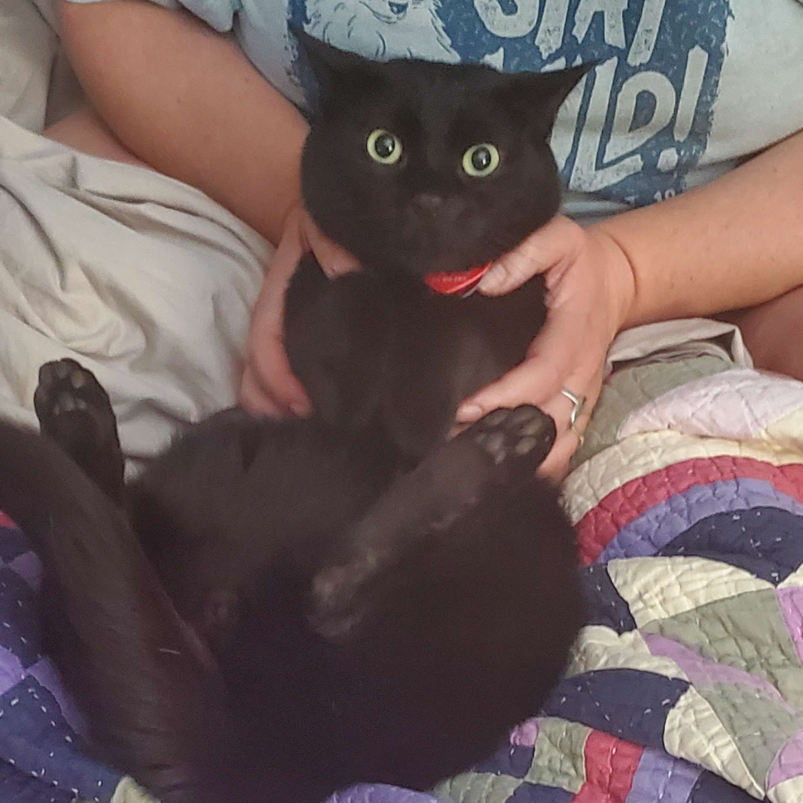

<h3>johnny</h3>
the least bloated all-in-one bot on discord  

> If you want to self-host johnny for yourself, [click here](consumer.readme.md).
>
> If you want to contribute, [click here](developer.readme.md).

## Contributors ✨

Thanks goes to these wonderful people ([emoji key](https://allcontributors.org/docs/en/emoji-key)):

<!-- ALL-CONTRIBUTORS-LIST:START - Do not remove or modify this section -->
<!-- prettier-ignore-start -->
<!-- markdownlint-disable -->
<table>
  <tbody>
    <tr>
      <td align="center" valign="top" width="14.28%"><a href="https://newty.dev/"> <b>newt :D</b></a> <a href="https://github.com/newtykins/johnny/commits?author=newtykins" title="Code">💻</a> <a href="https://github.com/newtykins/johnny/commits?author=newtykins" title="Documentation">📖</a> <a href="#tutorial-newtykins" title="Tutorials">✅</a> <a href="#projectManagement-newtykins" title="Project Management">📆</a> <a href="#ideas-newtykins" title="Ideas, Planning, & Feedback">🤔</a></td>
    </tr>
  </tbody>
</table>

<!-- markdownlint-restore -->
<!-- prettier-ignore-end -->

<!-- ALL-CONTRIBUTORS-LIST:END -->

This project follows the [all-contributors](https://github.com/all-contributors/all-contributors) specification. Contributions of any kind welcome!

licensed with the <a href="license.md">opinionated queer license v1.1</a> - tl;dr see <a href="https://oql.avris.it/">here</a> :]
